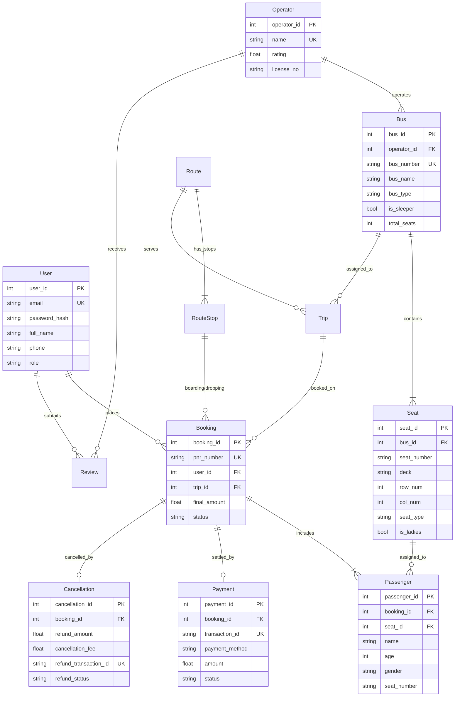

# Blue Bus — Backend Architecture Specification

## 🏗️ 1. High-Level Architecture Overview

Blue Bus is architected using a decoupled **Layered Client-Server Architecture** designed for high throughput, real-time concurrency safety, and relational data integrity.

```mermaid
graph TD
    Client["Client Layer<br/>(React 19 + Vite SPA @ localhost:3000)"]
    Proxy["Reverse Proxy / API Gateway<br/>(Vite Proxy -> FastAPI @ localhost:8080)"]
    
    subgraph FastAPI_Backend ["FastAPI Backend (Python 3.13)"]
        AuthRouter["/api/auth<br/>(JWT + Salted SHA-256)"]
        BusesRouter["/api/buses<br/>(Search & Filters)"]
        RoutesRouter["/api/routes<br/>(Corridors & Stops)"]
        TripsRouter["/api/trips<br/>(Seat Map & Layout)"]
        BookingsRouter["/api/bookings<br/>(PNR & Seat Swap)"]
        PaymentsRouter["/api/payments<br/>(Sandbox Gateway)"]
        CancelsRouter["/api/cancellations<br/>(Tiered Refunds)"]
        ReviewsRouter["/api/reviews<br/>(Ratings Engine)"]
        CouponsRouter["/api/coupons<br/>(Promo Engine)"]
        AdminRouter["/api/admin<br/>(Analytics KPIs)"]
    end

    subgraph Service_Engine ["Business Logic & Validation Layer"]
        LayoutEngine["Deck & Berth Layout Engine"]
        GenderSafety["Gender & Age Safety Validator"]
        RefundEngine["Tiered Departure Refund Engine"]
        SwapEngine["Seat Swap & Relocation Engine"]
        Concurrency["ACID Transaction Isolation"]
    end

    subgraph Database_Layer ["Persistence Layer"]
        SQLAlchemy["SQLAlchemy 2.0 ORM"]
        SQLite["SQLite Relational Database (bluebus.db)"]
    end

    Client -->|HTTP / JSON Requests| Proxy
    Proxy -->|REST Endpoints| FastAPI_Backend
    FastAPI_Backend --> Service_Engine
    Service_Engine --> SQLAlchemy
    SQLAlchemy --> SQLite
```

---

## 🏛️ 2. Architectural Layers

### 1. Presentation Layer (Frontend)
- **Framework**: React 19 + Vite
- **Port**: `http://localhost:3000`
- **Responsibilities**:
  - Interactive RedBus-style seat map with lower/upper deck sleeper and seater views.
  - Passenger safety visualization showing occupant age & gender (`♀ 28F`, `♂ 34M`).
  - Search engine with instant city dropdown suggestions.
  - Sandbox checkout supporting UPI QR code, Cards, and Net Banking.
  - Official printable E-Ticket rendering with dynamic SVG QR code.
  - 1-click Seat Swap modal for confirmed bookings.

### 2. API Gateway & Routing Layer (FastAPI)
- **Framework**: FastAPI (Asynchronous Python 3.13)
- **Port**: `http://localhost:8080`
- **Swagger Documentation**: `http://localhost:8080/docs`
- **Middleware**:
  - `CORSMiddleware`: Permits requests from `localhost:3000` and intranet clients.
  - Custom Request Lifespan: Auto-seeds initial Indian bus routes, operators, schedules, and promo coupons on first boot.

### 3. Business Logic & Safety Services
1. **Gender & Solo Traveler Safety Engine**:
   - For every occupied seat on a trip, computes adjacent passenger gender and age bracket.
   - Preserves passenger anonymity (no personal contact/name revealed) while projecting essential safety demographics (`FEMALE, 24 yrs` / `MALE, 32 yrs`).
   - Distinguishes female-reserved quota berths (`LADIES_RESERVED`) from general availability.
2. **Concurrency & Double-Booking Protection**:
   - Validates seat availability at query time and atomically during checkout commit.
   - Enforces unique constraint `UniqueConstraint("bus_id", "seat_number")` and active booking verification before issuing PNRs.
3. **Tiered Departure Refund Algorithm**:
   - Computes hours remaining until departure:
     $$\Delta t = t_{\text{departure}} - t_{\text{cancellation}}$$
   - $\Delta t > 24\text{ hours}$: $90\%$ refund ($10\%$ cancellation fee).
   - $12 \le \Delta t \le 24\text{ hours}$: $75\%$ refund ($25\%$ cancellation fee).
   - $\Delta t < 12\text{ hours}$: $50\%$ refund ($50\%$ cancellation fee).
4. **Seat Swap & Relocation Mechanism**:
   - Allows a confirmed passenger to change their seat to any currently unoccupied berth/seat on the same bus trip.
   - Validates seat belongs to the same bus and updates fare and passenger assignment in an atomic database transaction.

---

## 🗄️ 3. Relational Data Model (13 Entities)

---

## 📋 4. Core API Endpoints Reference

| Method | Endpoint | Description |
|---|---|---|
| `POST` | `/api/auth/register` | Register new user account |
| `POST` | `/api/auth/login` | Authenticate user & issue JWT bearer token |
| `GET` | `/api/auth/me` | Fetch active user profile details |
| `GET` | `/api/routes/cities` | Fetch all available source & destination cities |
| `GET` | `/api/buses/search` | Search trips with date, bus type, and time slot filters |
| `GET` | `/api/trips/{trip_id}/seats` | Fetch deck-aware seat layout with occupant age & gender |
| `POST` | `/api/bookings` | Reserve seats for multiple passengers & record payment |
| `GET` | `/api/bookings/my` | List all bookings placed by current user |
| `GET` | `/api/bookings/pnr/{pnr}` | Fetch complete E-Ticket data by PNR number |
| `POST` | `/api/bookings/{pnr}/swap-seat` | **Instant seat swap / relocation on active trip** |
| `GET` | `/api/cancellations/preview/{pnr}` | Calculate refund preview breakdown before cancelling |
| `POST` | `/api/cancellations/{pnr}` | Cancel booking and generate refund transaction record |
| `GET` | `/api/coupons` | Fetch active promotional codes and discounts |
| `POST` | `/api/coupons/apply` | Validate coupon code and compute instant discount |
| `GET` | `/api/reviews` | Fetch verified passenger reviews for buses/operators |
| `POST` | `/api/reviews` | Submit star rating (1-5) and feedback comment |
| `GET` | `/api/admin/analytics` | Executive dashboard KPIs: Revenue, Occupancy, Cancellations |
| `GET` | `/api/admin/all-bookings` | Fleet-wide reservation manifest with search & filter |
